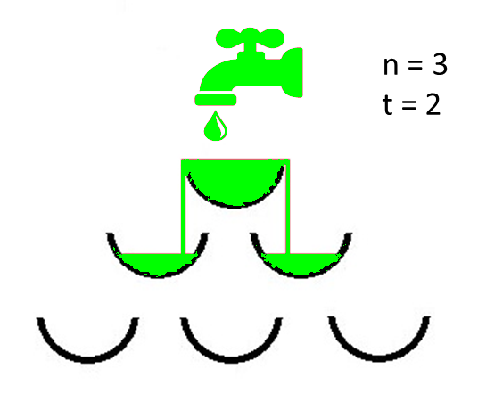
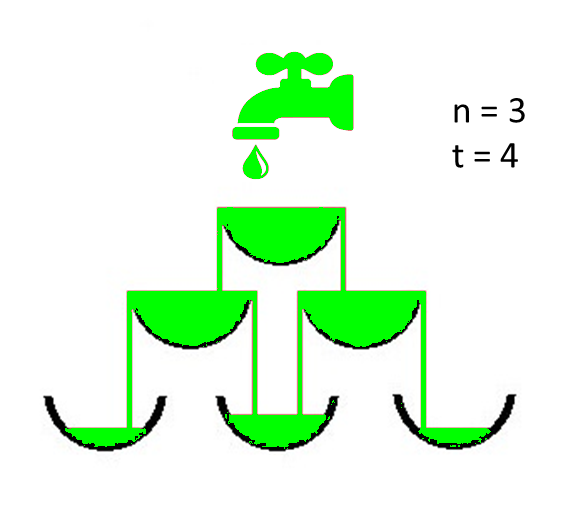

Solution 

Examples:

   Input: N = 3, T = 2
   Output: 1
   Explanation:
   View of Structure with N = 3 and at a time T = 2 after the tap has been opened
    
   
Input: N = 3, T = 4
Output: 3
Explanation:
View of Structure with N = 3 and at a time T = 4 after the tap has been opened

More Explanation :
Naive Approach: The simplest approach to solve the problem is to check if it is possible to completely fill x vessels in T seconds or not. If found to be true, check for x+1 vessels and repeat so on to obtain the maximum value of x.
Time Complexity: O(N3)
Auxiliary Space: O(1)

Efficient Approach: 
The above approach can be optimized using Dynamic Programming. Follow the steps below to solve the problem:

   Store the vessel structure in a Matrix, say M, where M[i][j] denotes the jth vessel in the ith level.
    For any vessel M[i][j], the connected vessels at an immediately lower level are M[i + 1][j] and M[i + 1][j + 1].
    Initially, put all water in the first vessel i, e. M[0][0] = t.
    Recalculate the state of the matrix at every increment of unit time, starting from the topmost vessel i, e. M[0][0] = t.
    If the amount of water exceeds the volume of the vessel, the amount flowing down from a vessel is split into 2 equal parts filling the two connected vessels at immediately lower level.

// C++ program to implement 
// the above approach 
#include <bits/stdc++.h> 
using namespace std; 

int n, t; 

// Function to find the number of 
// completely filled vessels 
int FindNoOfFullVessels(int n, int t) 
{ 
	
	// Store the vessels 
	double Matrix[n][n]; 

	// Assuming all water is present 
	// in the vessel at the first level 
	Matrix[0][0] = t * 1.0; 

	// Store the number of vessel 
	// that are completely full 
	int ans = 0; 

	// Traverse all the levels 
	for(int i = 0; i < n; i++) 
	{ 
		
		// Number of vessel at each 
		// level is j 
		for(int j = 0; j <= i; j++) 
		{ 
			
			// Calculate the exceeded 
			// amount of water 
			double exceededwater = Matrix[i][j] - 1.0; 

			// If current vessel has 
			// less than 1 unit of 
			// water then continue 
			if (exceededwater < 0) 
				continue; 

			// One more vessel is full 
			ans++; 

			// If left bottom vessel present 
			if (i + 1 < n) 
				Matrix[i + 1][j] += exceededwater / 2; 

			// If right bottom vessel present 
			if (i + 1 < n && j + 1 < n) 
				Matrix[i + 1][j + 1] += exceededwater / 2; 
		} 
	} 
	return ans; 
} 

// Driver Code 
int main() 
{ 
	
	// Number of levels 
	int N = 3; 

	// Number of seconds 
	int T = 4; 

	// Function call 
	cout << FindNoOfFullVessels(N, T) << endl; 
	
	return 0; 
} 

// This code is contributed by Jayadev
